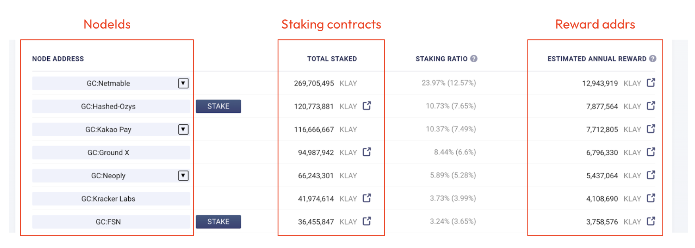
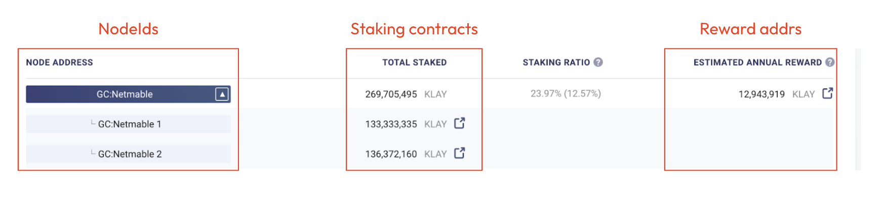

# Anatomy of the AddressBook

## Purpose

- In Mainnet and Kairos, a contract is deployed since the genesis block at a special address:
  ```
  0x0000000000000000000000000000000000000400
  ```
  - [Mainnet AddressBook](https://scope.klaytn.com/account/0x0000000000000000000000000000000000000400?tabId=contractCode)
  - [Kairos AddressBook](https://baobab.scope.klaytn.com/account/0x0000000000000000000000000000000000000400?tabId=contractCode)
  - [Source code](../contracts/legacy/AddressBook.sol)
- It is the official directory for Klaytn [Consensus Nodes (CNs)](https://docs.klaytn.foundation/content/klaytn/design/consensus-mechanism#consensus-mechanism-in-klaytn). Klaytn nodes perceive CNs by reading the AddressBook contract.
- For an entity to become a Klaytn Governance Council (GC) member, they must be registered to the AddressBook by Klaytn team.

## Data structure

- The AddressBook stores three kinds of addresses
  - [N] NodeID: The address used to sign BFT consensus messages
  - [S] StakingContract: The address of CnStaking contract that holds staked KLAYs
  - [R] RewardAddress: The address where block rewards are accumulated
  ```solidity
  // AddressBook.sol
  address[] private cnNodeIdList;
  address[] private cnStakingContractList;
  address[] private cnRewardAddressList;
  ```
- The AddressBook is a collection of 3-tuples `(N,S,R)`.
  ```
  ( N1  S1  R1 )  - an entry for GC member 'A'
  ( N2  S2  R2 )  - an entry for GC member 'B'
  ( N3  S3  R3 )  - an entry for GC member 'C'
  ```
- You can see it in [KlaytnScope](https://scope.klaytn.com/gcinfo/council).
  
- Notice that some GC member has multiple staking contracts. GC members can own multiple staking contracts for their convenience. They could want to separate accounts for financial affairs, or to run [public staking services](https://klayportal.hashquark.io/#/).
  
- `(N S R)` tuples with the same reward address are considered to belong to the same GC member. There is no established name for the feature, but I would call it _consolidated staking_.
  - The AddressBook wasn't designed with multiple staking contracts for a GC member in mind. And the AddressBook contract could not be upgraded after the mainnet launched. Thus, this workaround was introduced.
  - The first NodeID of a GC member is its representative NodeID. All consensus messages are signed with this address. Other NodeIDs are placeholders.
  - Klaytn block proposers are randomly selected with a probability correlated to consolidated staking amounts.
  ```
  ( N1  S1  R1 )  - an entry for GC member 'A'
  ( N2  S2  R1 )  - another entry for GC member 'A'
  ( N3  S3  R2 )  - an entry for GC member 'B'
  *N1 is the representative NodeID of 'A'
  *Staking amount of 'A' is S1.balance + S2.balance
  ```

## Query

Because the AddressBook was not designed with consolidated staking in mind, consolidating its entries is not trivial. This poses a unique challenge in building on-chain voting systems based on GC staking amounts.

You basically have to iterate through all the entries and collect the entries with the same reward address. Such implementations are found in [Klaytn Node](https://github.com/klaytn/klaytn/blob/v1.10.0/reward/staking_info.go#L201) and [StakingTracker contract](../contract/StakingTracker.sol).
