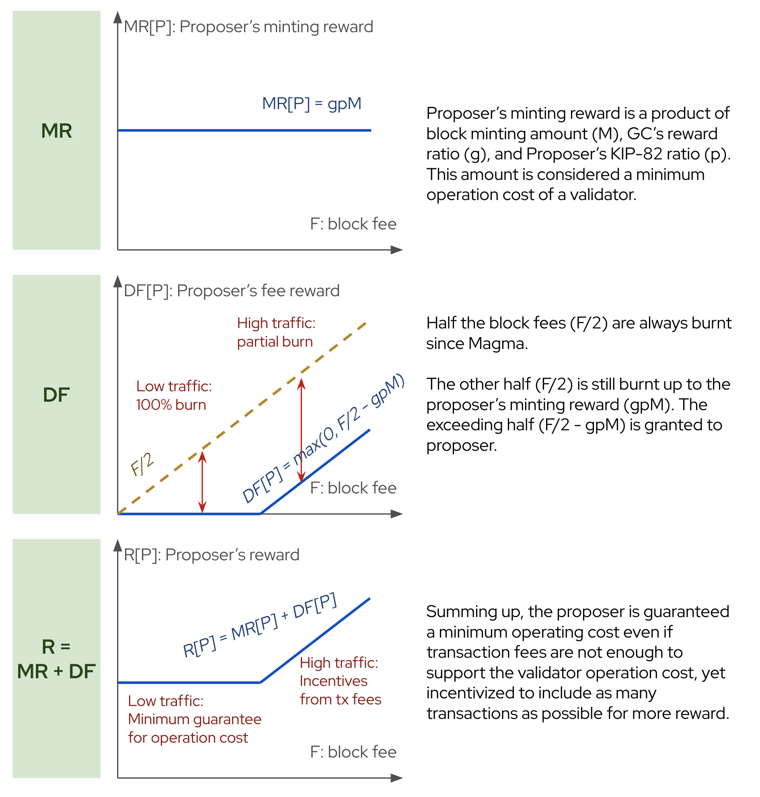

# kaiax/reward

This module is responsible for calculating the reward for validators.

## Concepts

### Block reward scheme

Block rewards are granted in native tokens (KAIA) every block. At high level, the reward source is first calculated from the minted tokens (inflation) plus the transaction fees payed by users. The source is then split into several recipients which consists of block validators and funds. Some of the fees are burnt, meaning the sum of distributed rewards is less than the source.

The rules have changed over hardforks.
- [Magma hardfork](https://github.com/klaytn/klaytn/releases/tag/v1.9.0) implements [KIP-71](https://kips.kaia.io/KIPs/kip-71) which burns the half of the transaction fees.
- [Kore hardfork](https://github.com/klaytn/klaytn/releases/tag/v1.10.0) implements [KIP-82](https://kips.kaia.io/KIPs/kip-82) which stipulates the reward distribution to the stakers and proposer.


### Reward source

- **Minting amount (M)**: The amount of token minted every block. Also known as the inflation. This amount is determined by the `reward.mintingamount` parameter in the genesis configuration and can be modified by governance.
- **Total Fee (F)**: Sum of all transaction fees in the block. Also called block fees.
  - Defined as `sum_i { tx[i].gasUsed * tx[i].effectiveGasPrice }`
  - Before KIP-162, the formula is simplified as `block.gasUsed * block.baseFeePerGas`
  - Before KIP-71, the formula is simplified as `block.gasUsed * UnitPrice` where UnitPrice is the fixed value determined by the `governance.unitprice` parameter in the genesis configuration and can be modified by governance.

### Reward distribution

- **Minting reward (MR)**: The reward from the minting amount.
- The fees originated from transaction fees can use one of either methods of accounting depending on the `reward.deferredtxfee` parameter in the genesis configuration. The two methods are mutually exclusive.
  - **Non-deferred fees (NDF)**: The accounting method whereby transaction fees are recognized and processed immediately upon execution of each transaction.
    - NDF method is used when `reward.deferredtxfee` is set to `false`.
    - The `TransitionDb()` function shall pay the transaction fees to the Coinbase or Rewardbase as soon as the transaction is executed. Therefore the balance of the block proposer changes within the same block.
  - **Deferred fees (DF)**: The accounting method whereby transaction fees are recognized and processed once at the end of the block.
    - DF method is used when `reward.deferredtxfee` is set to `true`. Kaia Mainnet and Kairos testnet use this method.
    - The `Finalize()` function shall pay the transaction fees to various recipients. The deferred fees are calculated along with the minting amount.

### Recipients

- **Validators (G)**: The block validators also known as the GC.
  - **Proposer (P)**: The validator who proposed the block. Receives rewards to its reward address.
  - **Stakers (S)**: The validators, including proposer, who staked enough tokens to be eligible for rewards. Receives rewards to its staking address.
- **Fund1 (X; KIF, KFF, KGF, PoC)**: The first fund. Its address is specified in the AddressBook contract. Its name has been changed over hardforks. Current name is KIF (Kaia Infrastructure Fund).
- **Fund2 (Y; KEF, KCF, KIR)**: The second fund. Its address is specified in the AddressBook contract. Current name is KEF (Kaia Ecosystem Fund).
- **Burnt (B)**: The amount burnt. Tokens are implicitly burnt during reward distribution; the transaction fees are deducted from the transaction senders but less amount are added to the reward recipients.
- **Reward ratio**: The reward distribution ratio among GC, Fund1, and Fund2 (G/X/Y).
  - Determined by the `reward.ratio` parameter in three nonnegative integer percentiles sums up to 100. e.g. `34/54/12`
- **KIP-82 ratio**: The reward distribution ratio between proposer and stakers (P/S).
  - Determined by the `reward.kip82` parameter in two nonnegative integer percentiles sums up to 100. e.g. `20/80`

### Allocation

- **Block Reward (R)**: Refers to all rewards distributed in a block including the minting amount, non-deferred fees, and deferred fees.
- **Pre-Magma rule**: The rule had been used since the genesis.
  - MR: M is distributed according to the reward ratio.
  - NDF: Whole F is granted to the proposer.
  - DF: F is distributed according to the reward ratio.
  - There has been a bug to the chains using the NDF method where the NDF and DF are both distributed to the proposer. However since those chains have already created such blocks, this is considered as the legal pre-Magma behavior. (https://github.com/klaytn/klaytn/issues/1692, https://github.com/klaytn/klaytn/pull/1709, https://github.com/klaytn/klaytn/pull/1886). This behavior only occurs in the chains with `istanbul.policy != 2` and `reward.deferredtxfee = false`. Kaia Mainnet and Kairos testnet are unaffected.
- **Magma rule (KIP-71)**: The rule since the Magma hardfork.
  - MR: M is distributed according to the reward ratio.
  - NDF: Half the fee (F/2) is granted to the proposer. The other half is burnt.
  - DF: Half the fee (F/2) is distributed according to the reward ratio. The other half is burnt.
- **Kore rule (KIP-82)**: The rule since the KIP-82 hardfork.
  - MR: M is distributed according to the reward ratio and KIP-82 ratio.
    - The rewards allocated to stakers is further allocated by their relative staking amounts. The staker rewards are proportional to their staking amounts exceeding the minimum staking amount. The minimum staking amount refers to the `reward.minstake` parameter which determines the staking requirement to be a validator.
    - If no validator has staked more than the minimum staking amount, all staking rewards are sent to the proposer.
    - Any remainder from the division math is sent to the proposer, simplifying the calculation of total rewards.
  - NDF: Half the fee (F/2) is granted to the proposer. The other half is burnt.
  - DF: Proposer receives `max(0, F/2 - gpM)` and rest of the fees are burnt.
    - The proposer's minting reward is fixed to a product of minting amount (M), validator's reward ratio (g) and KIP-82 proposer ratio (p). This amount is considered the minimum operation cost of a validator.
    - Among the fees (F), half is always burnt since Magma. The other half (F/2) is burnt up to the proposer's minting reward (gpM), but the exceeding part (F/2 - gpM) is granted to the proposer.
    - Summing up, the proposer is guaranteed a minimum even if transaction fees are no enough to support the validator operating cost, yet incentivized to include as many transactions as possible for more reward.



## Persistent schema

 This module does not persist any data.

## In-memory structures

### RewardConfig

`RewardConfig` is a refined reward-related parameters.

### RewardSummary

```go
type RewardSummary struct {
	Minted   *big.Int `json:"minted"`
	TotalFee *big.Int `json:"totalFee"`
	BurntFee *big.Int `json:"burntFee"`
}
```

`RewardSummary` is a summary of reward components. Calculation of it does not require StakingInfo so it can be calculated in full nodes. Useful for tracking the total supply of the native token.

### RewardSpec

```go
type RewardSpec struct {
	RewardSummary
	Proposer *big.Int                    `json:"proposer"`
	Stakers  *big.Int                    `json:"stakers"`
	KIF      *big.Int                    `json:"kif"`
	KEF      *big.Int                    `json:"kef"`
	Rewards  map[common.Address]*big.Int `json:"rewards"`
}
```

`RewardSpec` is a reward distribution specification for a block. Describes each reward component and their recipients.
- It can represent the deferred reward to be distributed at the end of the block (e.g. FinalizeBlock).
- It can also represent the block reward including both non-deferred and deferred fees (e.g. kaia_getReward API).

### RewardResponse

`RewardResponse` is a response type for `kaia_getReward` API.

### AccumulatedRewardResponse

`AccumulatedRewardResponse` is a response type for `kaia_getRewardsAccumulated` API.

## Module lifecycle

### Init

- Dependencies:
  - ChainDB: Raw key-value interface to access this module's persistent schema.
  - ChainConfig: Holds the genesis configuration.
  - Chian: Access to blocks, transactions and receipts.
  - kaiax/gov: Access to the governance parameters.

### Start and stop

This module does not have any background threads.

## Block processing

### Consensus

#### FinalizeHeader

After all transactions are processed, calculate and accredit the block reward.

### Execution

#### PostRunTx

When the non-deferred fees method is used, the transaction fees are accredited to the proposer after a transaction is executed.

### Rewind

This module does not have any persistent data to delete.

## APIs

### kaia_getReward

### kaia_getRewardsAccumulated

## Getters

- GetDeferredReward: Returns the deferred reward specification for the given block that is being created. Used in FinalizeHeader.
  ```
  GetDeferredReward(header, txs, receipts) -> RewardSpec
  ```
- GetBlockReward: Returns the reward distribution specification for the given block number. Includes both non-deferred fees and deferred fees. Therefore its result may differ from GetDeferredReward if the non-deferred fees method is used.
  ```
  GetBlockReward(num) -> RewardSpec
  ```
- GetRewardSummary: Returns the reward summary for the given block number.
  ```
  GetRewardSummary(num) -> RewardSummary
  ```
